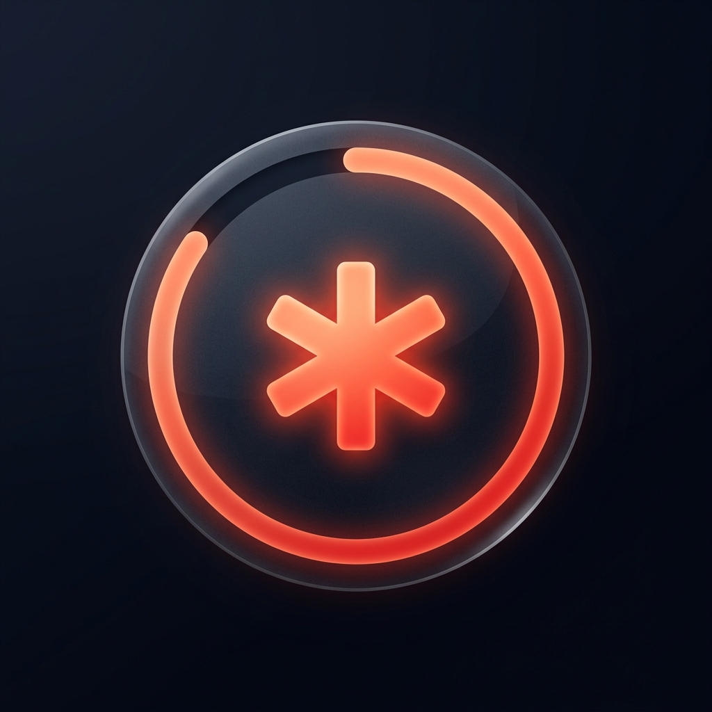

# AnthroStat

**A sleek, minimalist, cross-platform desktop widget to monitor your Claude AI session usage limits.**

Designed for power users who need to keep an eye on their Claude limits without switching tabs.

Made by [**Oromane**](https://github.com/oromane)

---

## ⬇️ Download & Install (Windows)

> **Get the app in one click — no build required.**

| Installer | Size | Link |
|-----------|------|------|
| 🟣 **`AnthroStat_0.1.0_x64-setup.exe`** (recommended) | ~4 MB | **[Download the .exe »](https://github.com/oromane/AnthroStat/releases/latest)** |
| 📦 `AnthroStat_0.1.0_x64_en-US.msi` | ~6 MB | [Download the .msi »](https://github.com/oromane/AnthroStat/releases/latest) |

**Install in 3 steps:**

1. Download **`AnthroStat_0.1.0_x64-setup.exe`** (also available in the [`releases/`](releases/) folder of this repo).
2. Run the installer — AnthroStat installs in seconds and adds a Start Menu shortcut.
3. Launch it, clic